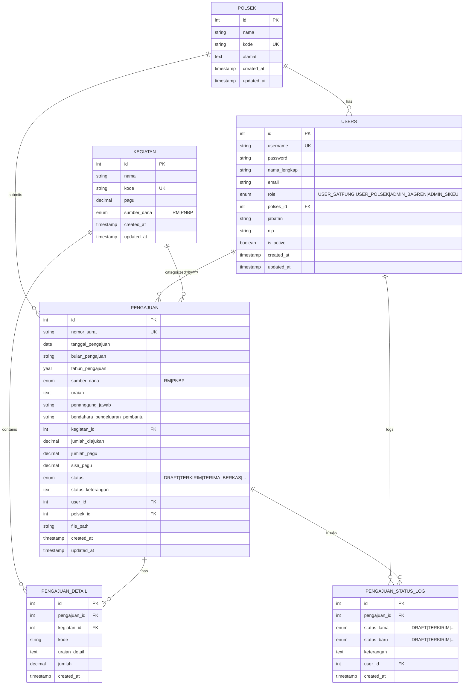
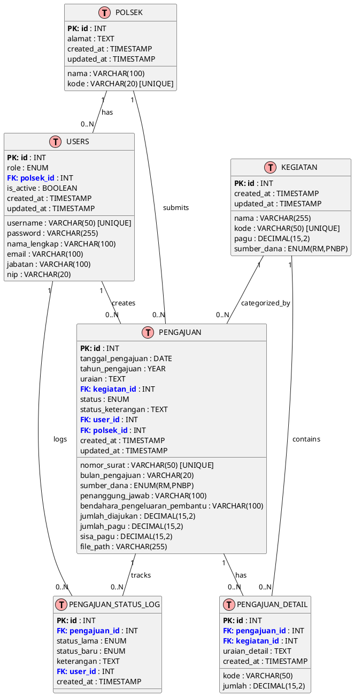

# 📊 Entity Relationship Diagram (ERD) - SIPANG POLRI

## 1. Mermaid ERD (Copy ke mermaid.live)



---

## 2. PlantUML Format



---

## 3. SQL ERD Code (Untuk Database Design Tools)

```sql
-- Complete ERD with all relationships
-- Tables: 6
-- Relationships: 8
-- Primary Keys: 6
-- Foreign Keys: 8

-- POLSEK (Police Stations)
-- Parent of: USERS, PENGAJUAN
-- No dependencies

-- USERS (Users/Accounts)
-- Parent of: PENGAJUAN, PENGAJUAN_STATUS_LOG
-- Foreign Keys: polsek_id -> POLSEK.id

-- KEGIATAN (Activities/Budget Items)
-- Parent of: PENGAJUAN, PENGAJUAN_DETAIL
-- No dependencies

-- PENGAJUAN (Budget Submissions)
-- Parent of: PENGAJUAN_DETAIL, PENGAJUAN_STATUS_LOG
-- Foreign Keys:
--   - kegiatan_id -> KEGIATAN.id
--   - user_id -> USERS.id
--   - polsek_id -> POLSEK.id

-- PENGAJUAN_DETAIL (Submission Line Items)
-- Parent of: None
-- Foreign Keys:
--   - pengajuan_id -> PENGAJUAN.id (CASCADE DELETE)
--   - kegiatan_id -> KEGIATAN.id

-- PENGAJUAN_STATUS_LOG (Status Change History)
-- Parent of: None
-- Foreign Keys:
--   - pengajuan_id -> PENGAJUAN.id (CASCADE DELETE)
--   - user_id -> USERS.id
```

---

## 4. Relational Model Summary

```
POLSEK (6 attributes)
├── 1:N → USERS
├── 1:N → PENGAJUAN

USERS (12 attributes)
├── N:1 ← POLSEK
├── 1:N → PENGAJUAN
└── 1:N → PENGAJUAN_STATUS_LOG

KEGIATAN (5 attributes)
├── 1:N → PENGAJUAN
└── 1:N → PENGAJUAN_DETAIL

PENGAJUAN (20 attributes)
├── N:1 ← KEGIATAN
├── N:1 ← USERS
├── N:1 ← POLSEK
├── 1:N → PENGAJUAN_DETAIL
└── 1:N → PENGAJUAN_STATUS_LOG

PENGAJUAN_DETAIL (5 attributes)
├── N:1 ← PENGAJUAN
└── N:1 ← KEGIATAN

PENGAJUAN_STATUS_LOG (5 attributes)
├── N:1 ← PENGAJUAN
└── N:1 ← USERS
```

---

## 5. Key Statistics

| Metric | Value |
|--------|-------|
| Total Tables | 6 |
| Total Columns | ~62 |
| Primary Keys | 6 |
| Foreign Keys | 8 |
| Unique Constraints | 5 |
| Indexes | 6 |
| Views | 2 |
| Relationships (1:N) | 8 |
| Cardinality | 1:N, N:1 |

---

## 6. Status Enum Values (PENGAJUAN)

```
DRAFT                  → Initial state, not submitted
TERKIRIM              → Submitted to Bagren
TERIMA_BERKAS         → Documents received by Bagren
DISPOSISI_KABAG_REN   → Assigned to Bagian Rena chief
DISPOSISI_WAKA        → Assigned to Deputy Chief
TERIMA_SIKEU          → Received by Finance (SIKEU)
DIBAYARKAN            → Paid/Disbursed
DITOLAK               → Rejected
```

---

## 7. Role Enum Values (USERS)

```
USER_SATFUNG          → Satuan Fungsi (Functional Unit) staff
USER_POLSEK           → Polsek (Police Station) staff
ADMIN_BAGREN          → Bagren (Budget) Admin
ADMIN_SIKEU           → SIKEU (Finance) Admin
```

---

## 8. Views Available

### v_pengajuan_complete
Join pengajuan with users, polsek, and kegiatan for complete submission data.

### v_status_tracking
Track status changes with user information and timestamps.

---

## How to Use This ERD

### Option 1: Mermaid (Free, Online)
1. Go to https://mermaid.live
2. Paste the Mermaid ERD code above
3. Export as image

### Option 2: PlantUML
1. Use PlantUML online: https://www.plantuml.com/plantuml/uml/
2. Paste the PlantUML code
3. Generate diagram

### Option 3: Database Design Tools
- **MySQL Workbench**: Can import SQL and visualize
- **Lucidchart**: Manual recreation with high detail
- **Diagrams.net**: Manual creation with shape library
- **DBDiagram.io**: Paste SQL or create visually

