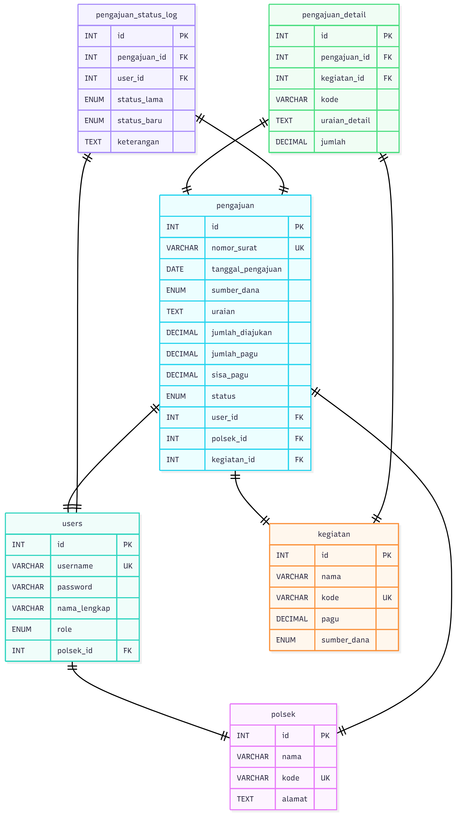

# 📑 Dokumentasi Proyek SIPANG POLRI (Sistem Anggaran Polisi RI)

## 💡 Konsep Dari Web Yang Saya Buat

**SIPANG POLRI** adalah Sistem Anggaran Polisi RI yang dirancang untuk mengelola proses pengajuan dan riwayat anggaran di lingkungan Kepolisian Republik Indonesia. Sistem ini bertujuan untuk menyediakan platform yang efisien dan transparan dalam pengajuan, pelacakan, dan pelaporan penggunaan anggaran, memastikan setiap unit dapat mengelola dan memantau ketersediaan dana secara *real-time*.

## 🛠️ Fitur Yang Tersedia

### Halaman Awal & Navigasi

* **Dashboard** (Halaman awal setelah login)
* **Login**
* **Pengajuan** (Formulir pengajuan anggaran)
* **Riwayat** (Melihat riwayat pengajuan dan statusnya)
* **Logout**

### Autentikasi

* **Login** dengan Username dan Password
* Penerapan **CAPTCHA** untuk keamanan login

### Multi User

#### Admin (Bidang Perencanaan/Anggaran - Bagren)

* Mengelola seluruh data master (User, Polsek, Kegiatan)
* Melihat semua pengajuan dari seluruh unit
* Memproses (Menyetujui/Menolak) pengajuan anggaran

#### User (Unit Polsek)

* Mengakses Halaman Awal/Dashboard setelah Login
* **Mengisi Formulir Pengajuan** anggaran
* Melihat **Riwayat Pengajuan** (status, detail) yang diajukan oleh unitnya

## 🔐 Akun Default

| Peran | Username | Password | Keterangan |
| :--- | :--- | :--- | :--- |
| **Admin** | `admin.bagren` | `password` | Mengelola data master & pengajuan |
| **User** | `plsk.grt.kta` | `password` | Membuat dan melihat pengajuan |

## 📐 ERD & UML

Berikut adalah diagram **Entity-Relationship Diagram (ERD)** dan **Unified Modeling Language (UML)** yang digunakan dalam sistem SIPANG POLRI.

### 1️⃣ Entity-Relationship Diagram (ERD)



*Deskripsi:* Menunjukkan relasi antara entitas seperti `User`, `Pengajuan`, `Kegiatan`, `Polsek`, dll., serta atribut dan primary/foreign key-nya.

### 2️⃣ UML Diagram


*Deskripsi:* Menampilkan struktur kelas, relasi antar kelas, dan fungsi utama sistem. Bisa juga diganti dengan **Use Case Diagram** jika lebih sesuai.

## 💻 Teknologi yang Digunakan

| Kategori | Teknologi |
| :--- | :--- |
| **Backend** | **Vanilla PHP** (Native PHP) |
| **Frontend** | HTML, CSS, JavaScript (Vanilla/Native) |
| **Database** | MySQL |

## 🛠️ Tools yang Digunakan

* **Web Server**: XAMPP (Apache, MySQL)
* **Web Browser**: Chrome, Firefox, Edge, dll.
* **Text Editor**: VSCode (Visual Studio Code)

## ⚠️ Persyaratan untuk Instalasi

Pastikan Anda telah menginstal dan mengkonfigurasi perangkat lunak berikut:

* PHP (Versi apa pun yang kompatibel dengan Vanilla PHP)
* Web Server (Apache melalui XAMPP)
* Database (MySQL melalui XAMPP)
* Web Browser

## 🚀 Cara Instalasi SIPANG POLRI

**1. Persiapan Server Lokal (XAMPP)**

1. Pastikan Anda telah menginstal **XAMPP**.
2. Jalankan modul **Apache** dan **MySQL** dari XAMPP Control Panel.
3. Akses `http://localhost/phpmyadmin` di browser Anda dan **buat database baru** (misalnya: `db_sipangpolri`).

**2. Clone Repository**

Clone repository proyek dari GitHub:

```bash
git clone <URL_REPO>
