# 📐 UML Diagram - SIPANG POLRI System

## 1. Class Diagram (Mermaid Format)

---

## 2. System Architecture Diagram

---

## 3. Sequence Diagram: Login Flow

---

## 4. Sequence Diagram: Pengajuan Approval Flow

---

## 5. Sequence Diagram: File Upload & Serving

---

## 6. Role-Based Access Control (RBAC)

---

## 7. Database Entity Relationship

---

## 8. State Diagram: Pengajuan Status Flow

---

## 9. Component Diagram

---

## 10. Activity Diagram: Create & Submit Pengajuan

---

## 11. Package Diagram

```mermaid
graph TB
    subgraph Config["📁 config/"]
        DBCFG["database_config.php<br/>Constants & Config"]
    end
    
    subgraph API["📁 api/"]
        MAIN["main.php<br/>Request Router"]
        ADMIN["admin_dashboard.php<br/>Admin Data"]
        FILE["get_file.php<br/>File Service"]
    end
    
    subgraph Pages["📁 Pages/"]
        ADMIN_PAGE["admin.php"]
        RIWAYAT["riwayat.php"]
        PENGAJUAN_PAGE["pengajuan.php"]
        LOGIN["login.php"]
    end
    
    subgraph Includes["📁 includes/"]
        HEADER["header.php"]
        FOOTER["footer.php"]
        NAVBAR["navbar.php"]
        AUTH_GUARD["auth_guard.php"]
    end
    
    subgraph Assets["📁 assets/"]
        CSS["📁 css/<br/>Stylesheets"]
        JS["📁 js/<br/>JavaScript"]
    end
    
    subgraph Database["📁 database/"]
        SQL["📁 SQL files<br/>Schema & Data"]
    end
    
    subgraph Uploads["📁 uploads/"]
        FILES["📄 Pengajuan files"]
    end
    
    MAIN --> DBCFG
    MAIN --> Config
    ADMIN_PAGE --> MAIN
    RIWAYAT --> MAIN
    PENGAJUAN_PAGE --> MAIN
    LOGIN --> MAIN
    PAGES --> Includes
    Pages --> Assets
    Config --> Database
    MAIN -.Upload.-> Uploads
    FILE -.Serve.-> Uploads
```

---

## 12. Deployment Architecture

```mermaid
graph TB
    Users["👥 End Users<br/>Browser"]
    
    subgraph Server["🖥️ Web Server<br/>XAMPP/Apache"]
        PHP["PHP 7.0+<br/>Interpreter"]
        FILES["Static Files<br/>CSS, JS, Images"]
    end
    
    subgraph Database["🗄️ Database Server<br/>MySQL/MariaDB"]
        MYSQL["sipang_polri<br/>Database"]
    end
    
    subgraph Storage["💾 File Storage<br/>Local Filesystem"]
        UPLOADS["uploads/<br/>Directory"]
    end
    
    Users -->|HTTP/HTTPS| Server
    PHP -->|PDO| Database
    PHP -->|Read/Write| Storage
    Files -->|Static Content| Users
    MYSQL -->|Data| PHP
```

---

## 13. API Endpoint Mapping

```mermaid
graph LR
    API["API<br/>api/main.php"]
    
    AUTH["🔐 Authentication"]
    PENGAJUAN["📄 Pengajuan"]
    ADMIN["⚙️ Admin"]
    DATA["📊 Data"]
    UTIL["🔧 Utility"]
    
    API --> AUTH
    API --> PENGAJUAN
    API --> ADMIN
    API --> DATA
    API --> UTIL
    
    AUTH --> LOGIN["action=login"]
    AUTH --> LOGOUT["action=logout"]
    AUTH --> SESSION["action=check_session"]
    AUTH --> INFO["action=get_user_info"]
    
    PENGAJUAN --> CREATE["action=create_pengajuan"]
    PENGAJUAN --> GETRIWAYAT["action=get_riwayat"]
    PENGAJUAN --> UPDATE["action=update_status"]
    PENGAJUAN --> APPROVE["action=approve_pengajuan_*"]
    PENGAJUAN --> REJECT["action=reject_pengajuan"]
    PENGAJUAN --> DELETE["action=delete_pengajuan"]
    
    ADMIN --> DASHBOARD["action=get_dashboard_data"]
    ADMIN --> STATS["api/admin_dashboard.php"]
    
    DATA --> EXPORT["action=export_data"]
    DATA --> DOWNLOAD["action=download_*"]
    DATA --> LOG["action=get_status_log"]
    
    UTIL --> KEGIATAN["action=get_kegiatan"]
    UTIL --> POLSEK["action=get_polsek"]
    UTIL --> FILE["api/get_file.php"]
```

---

## UML Documentation Summary

| Diagram | Purpose | Key Elements |
|---------|---------|--------------|
| **Class** | Object structure & relationships | Database, Auth, PengajuanManager, Models |
| **Architecture** | System layers & communication | Presentation, API, Business, Data |
| **Sequence (Login)** | Authentication flow | User, Browser, Auth, DB |
| **Sequence (Approval)** | Pengajuan approval workflow | Modal, API, Manager, Database |
| **Sequence (Files)** | File upload & serving | Form, API, FileManager, Storage |
| **RBAC** | Role permissions mapping | 4 Roles × 12+ Permissions |
| **ERD** | Database structure | 6 Tables, 8 Relationships |
| **State** | Pengajuan status transitions | 8 States, Rejection path |
| **Component** | System components & interfaces | Client, Server, Business, Data |
| **Activity** | User workflows | Create/Submit process flow |
| **Package** | Directory structure | Code organization |
| **Deployment** | Runtime infrastructure | Servers, Database, Storage |
| **API Endpoints** | API operations mapping | 20+ Endpoints |

---

## How to Use These Diagrams

### Online Viewing:
1. **Mermaid** (all diagrams): Copy code → https://mermaid.live
2. **PlantUML**: Copy specific diagram → https://www.plantuml.com/plantuml/uml/

### Export as Image:
- Mermaid: Right-click → Export as PNG/SVG
- PlantUML: Generate → Download image

### Documentation:
- Share with team for architecture understanding
- Use for onboarding new developers
- Reference for maintenance & troubleshooting
